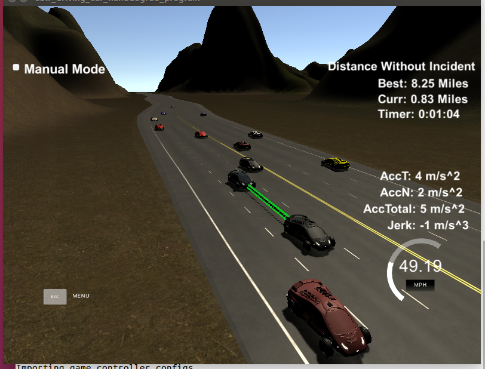
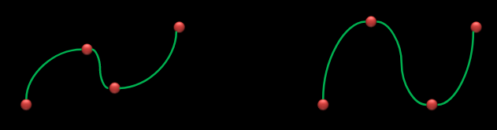
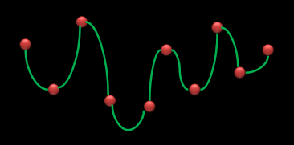
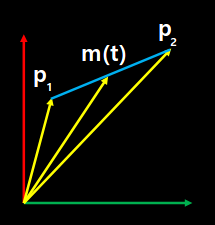
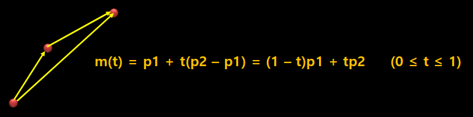
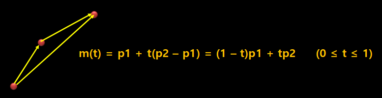
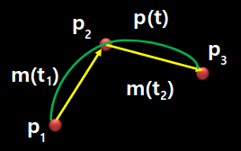
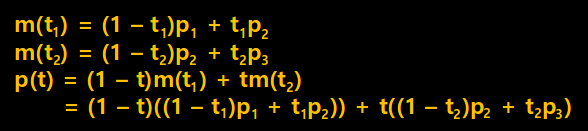
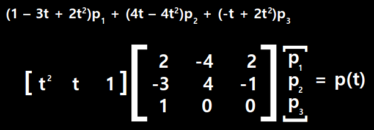

# Path Planning Project Overview  
In this project, I need to implement Path Planning Algorithm to drive a car on the highway that is the simulator. The Simulator sends the information about the position and velocity of car and sensor fusion data about the rest of the cars on the highway (ex: Car ID, Velocity, Position). The Sampling Time is 0.02 so it can expects the trajectory of the car every 0.02 seconds. Here are some important limitation that is speed, acceleration, jerk, collision, lane change time, and etc. Finally use proper curve function to drive car with spline, bezier curve, and etc.
   
## Make Configuration  

I modify some fragment of CMakeLists.txt to use gdb for debug the code.  
add_definitions(-std=c++11 -g) is the debug option to use gdb.  

```c
project(Path_Planning)

cmake_minimum_required (VERSION 3.5)

#add_definitions(-std=c++11 -g)
add_definitions(-std=c++11)

set(CXX_FLAGS "-Wall")
set(CMAKE_CXX_FLAGS, "${CXX_FLAGS}")

set(sources src/main.cpp)
#set(sources src2/main.cpp src2/jerk_min_traj.cpp src2/vehicle.cpp)

if(${CMAKE_SYSTEM_NAME} MATCHES "Darwin") 

include_directories(/usr/local/include)
include_directories(/usr/local/opt/openssl/include)
link_directories(/usr/local/lib)
link_directories(/usr/local/opt/openssl/lib)
link_directories(/usr/local/Cellar/libuv/1.11.0/lib)

endif(${CMAKE_SYSTEM_NAME} MATCHES "Darwin") 

add_executable(path_planning ${sources})

target_link_libraries(path_planning z ssl uv uWS)
```

### Goals
In this project your goal is to safely navigate around a virtual highway with other traffic that is driving +-10 MPH of the 50 MPH speed limit. You will be provided the car's localization and sensor fusion data, there is also a sparse map list of waypoints around the highway. The car should try to go as close as possible to the 50 MPH speed limit, which means passing slower traffic when possible, note that other cars will try to change lanes too. The car should avoid hitting other cars at all cost as well as driving inside of the marked road lanes at all times, unless going from one lane to another. The car should be able to make one complete loop around the 6946m highway. Since the car is trying to go 50 MPH, it should take a little over 5 minutes to complete 1 loop. Also the car should not experience total acceleration over 10 m/s^2 and jerk that is greater than 10 m/s^3.

#### The map of the highway is in data/highway_map.txt
Each waypoint in the list contains  [x,y,s,dx,dy] values. x and y are the waypoint's map coordinate position, the s value is the distance along the road to get to that waypoint in meters, the dx and dy values define the unit normal vector pointing outward of the highway loop.

The highway's waypoints loop around so the frenet s value, distance along the road, goes from 0 to 6945.554.

#### Main car's localization Data (No Noise)

["x"] The car's x position in map coordinates
["y"] The car's y position in map coordinates
["s"] The car's s position in frenet coordinates
["d"] The car's d position in frenet coordinates
["yaw"] The car's yaw angle in the map
["speed"] The car's speed in MPH

#### Previous path data given to the Planner

//Note: Return the previous list but with processed points removed, can be a nice tool to show how far along
the path has processed since last time. 

["previous_path_x"] The previous list of x points previously given to the simulator
["previous_path_y"] The previous list of y points previously given to the simulator

#### Previous path's end s and d values 

["end_path_s"] The previous list's last point's frenet s value
["end_path_d"] The previous list's last point's frenet d value

#### Sensor Fusion Data, a list of all other car's attributes on the same side of the road. (No Noise)

["sensor_fusion"] A 2d vector of cars and then that car's [car's unique ID, car's x position in map coordinates, car's y position in map coordinates, car's x velocity in m/s, car's y velocity in m/s, car's s position in frenet coordinates, car's d position in frenet coordinates. 

## Details

1. The car uses a perfect controller and will visit every (x,y) point it recieves in the list every .02 seconds. The units for the (x,y) points are in meters and the spacing of the points determines the speed of the car. The vector going from a point to the next point in the list dictates the angle of the car. Acceleration both in the tangential and normal directions is measured along with the jerk, the rate of change of total Acceleration. The (x,y) point paths that the planner recieves should not have a total acceleration that goes over 10 m/s^2, also the jerk should not go over 50 m/s^3. (NOTE: As this is BETA, these requirements might change. Also currently jerk is over a .02 second interval, it would probably be better to average total acceleration over 1 second and measure jerk from that.

2. There will be some latency between the simulator running and the path planner returning a path, with optimized code usually its not very long maybe just 1-3 time steps. During this delay the simulator will continue using points that it was last given, because of this its a good idea to store the last points you have used so you can have a smooth transition. previous_path_x, and previous_path_y can be helpful for this transition since they show the last points given to the simulator controller with the processed points already removed. You would either return a path that extends this previous path or make sure to create a new path that has a smooth transition with this last path.

## Tips

A really helpful resource for doing this project and creating smooth trajectories was using http://kluge.in-chemnitz.de/opensource/spline/, the spline function is in a single hearder file is really easy to use.

## Achievement

Success to drive car at least 4.32 miles without incident.  



## Reflections of Generating Paths

First I try to implement all algorithm with C Language which one is provided by Udacity.  
You can see this code at below link.  

https://github.com/silenc3502/CPathPlan/blob/master/test/eval_ptg.c  

There are big problem to implement random number.  
I can't implement same engine that is random.gauss() of python.  
I need to study numerical analysis more and need to understand of python's random number generation mechanism based on gaussian distribution.  
My Matrix functions are all OK to operate correct.  
However I failed to implement random number generation.  

So I change my mind to implement it to use provided code fragment.  
That is the src/main.cpp code.  
Now I start to explain about my strategy to implement it.

It starts at line 182 ~ 187 for declare variable to use path planner algorithm.  
And at line 211, I add this variables.  
My additional algorithm code is start at line 249 ~ 434.  
This code has three parts that is Predictation, Behavior Planning, Trajectory with Spline.

* Predictation

1) Does my front car interfere traffic ?  
2) Is it safe to change right or left lane ?  

This two question is the core of this part.  

* Behavior Planning  

1) Speed up or down ?  
2) Can I change the lane when the other car is exist in front of my car ?  

This part decide upon questions.  

* Trajectory with Spline  

1) Calculate trajectory with speed & lane from the Behavior Planning, and past Path Points.  
2) Make Spline more continuity(Moving trajectory can't be descrete)  

* Spline Basics  

If we want represent curve then there are many method that is Spline, Bezier curve, and etc.  
Mathematician make new method to represent curve with Polynomials that is the Spline.  

Spline needs Control Points.  
And the gap between Control Points is called the Interval or Segment.  



There are two kinds of splines.  
One is Interpolating Spline and the other is Approximating Spline.  

Interpolating Spline passes Control Points precisely and uses Control Points to precisely control the Shape of Curve.  
Approximating Spline don't pass through the Control Points, and some pass throught the Start and End Control Points.  

Generally use Interpolating Spline for each section to ensure the accuracy of the curve after use Approximating Spline to make smooth curve.  

Locality of Spline has big mean to make curve.  
If someone change the Control Points then we have to change all of the curve function.  



This is the reason of Mathematician use 3rd order(Cubic) Function for Spline.  

Now I can explain about the Cardinal Spline.  
We can represent Spline with paramter looks like below picture.  



m(t) is the parameter representation of the line between p1 and p2.  
Look below picture then we can get the formula!  



If parameter t is going 0 to 1 then it can draw Straight Line.  
t = 0 then m(t) is p2 and t = 1 then m(t) is p1.  

Let's assume like below.  

p1 = (x1, y1, z1), p2 = (x2, y2, z2)  



We can make the Straight Line with this mechanism.  

Now let's think about the curve looks like below.  



We can see the curve between p1 and p2 that is m(t1) and between p2 and p3 that is m(t2).  
Now think about the (0 <= t <= 1) range.  
The formula can be expanded as shown below.  



Let's think abouth the formula.  
The point p1 at t1 = 0 in m(t1) is the point at t = 0 even in the case of p(t).  
The point p2 with t1 = 1 can be regarded as a midpoint with t = 0.5 at the curve p(t).  
A point p2 with t2 = 0 in m2(t) can also be considered as t = 0.5.  
It can be seen that t1 = 2t through t = 0.5 when t1 = 0 and t = 0 and t1 = 1.  
It can be seen that t = 0 when t1 = 0 and t = 0.5 when t1 = 1.  
So we can know t1 = 2t.  
t = 0.5 when t1 = 0.5 and t = 0.5 when t2 = 0.  
So we can know t2 = 2t - 1.  
Apply it to upon formula then we can get below formula.  



We can use this Spline Function from below link.  

https://kluge.in-chemnitz.de/opensource/spline/  

## Future Works

This time I failed to implement it all with C Language not C++.
However I'll try it when I finished to analysis random.gauss(mu, sigma) pattern at below link.  

random - https://github.com/python/cpython/blob/master/Modules/_randommodule.c#L131  
random.gauss() - https://github.com/python/cpython/blob/master/Lib/random.py#L598  
